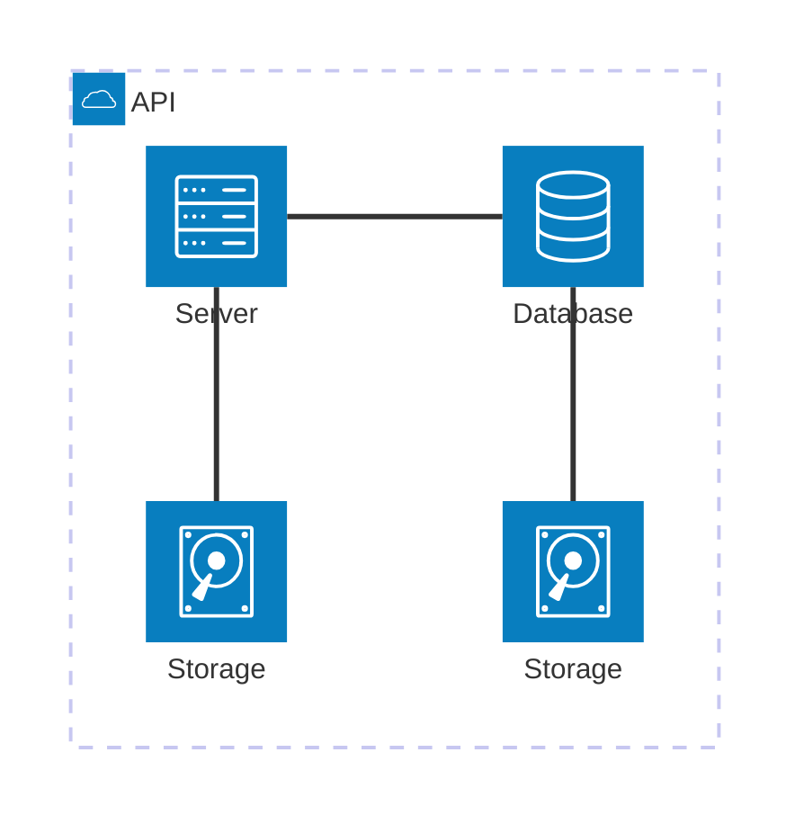

## Objetivo

O objetivo geral deste primeiro roteiro é compreender os conceitos fundamentais de uma plataforma de gerenciamento de hardware, especificamente o MAAS (Metal as a Service), e introduzir noções básicas sobre redes de computadores, proporcionando uma base sólida para futuro aprofundamento.

Para isso, foi utilizado o seguinte material:

    1 NUC (main) com 10Gb e 1 SSD (120Gb)
    1 NUC (server1) com 12Gb e 1 SSD (120Gb)
    1 NUC (server2) com 16Gb e 2 SSD (120Gb+120Gb)
    3 NUCs (server3, server4 e server5) com 32Gb e 2 SSD (120Gb+120Gb)
    1 Switch DLink DSG-1210-28 de 28 portas
    1 Roteador TP-Link TL-R470T+


## Criando a Infraestrutura

### Instalação do Ubuntu

Realizou-se a instalação do Sistema Operacional Ubuntu Server 22.04 LTS na NUC main. Para isso, a imagem do mesmo foi baixada, colocada em um pendrive e, esse, utilizado para realizar o boot de instalação na máquina. Com isso, definiu-se o hostname, o login, a senha, o IP fixo (172.16.0.3) e o DNS (172.20.129.131).

### Acesso à main

Para acessar a máquina main, conectou-se um cabo de rede entre o computador e o switch, permitindo o acesso à rede local.

Dentro da rede, utilizou-se o seguinte comando:

<!-- termynal -->
``` bash
ssh cloud@172.16.0.3
```
Como pode ser observado na figura abaixo:


/// caption
Acesso à máquina main
///

### Instalação do MAAS

O MAAS foi instalado para atuar como o gerenciador de hardware do projeto.

Para realizar sua instalação, na versão "stable" 3.5, dentro da máquina main, utilizaram-se os seguintes comandos:

I.
<!-- termynal -->
``` bash
sudo apt update && sudo apt upgrade -y
```
II.
<!-- termynal -->
``` bash
sudo snap install maas --channel=3.5/stable
```
III.
<!-- termynal -->
``` bash
sudo snap install maas-test-db
```

### Configuração do MAAS

Primeiramente, foi realizada a inicialização do MAAS, da seguinte maneira:

<!-- termynal -->
``` bash
sudo maas init region+rack --maas-url http://172.16.0.3:5240/MAAS --database-uri maas-test-db:///
```
Em seguida, a criação do usuário admin:

<!-- termynal -->
``` bash
sudo maas createadmin
```

Com isso, determinou-se o login e a senha.

Posteriormente, foi necessário gerar um par de chaves para autenticação, utilizando o seguinte comando:

<!-- termynal -->
``` bash
ssh-keygen -t rsa
```

E acessar essa chave para poder copiá-la, dessa maneira:

<!-- termynal -->
``` bash
cat ./.ssh/id_rsa.pub
```

A chave pública obtida foi a da figura a seguir:


/// caption
Chave pública
///

### Acessando o dashboard do MAAS

O dashboard do MAAS foi acessado através da seguinte URL:

    http://172.16.0.3:5240/MAAS

Porém, antes disso, foi necessário desativar o UFW(firewall), pois ele estava bloqueando todas as portas, menos a 22.

Após realizar o login, configurou-se o DNS Forwader com o DNS do Insper, sendo assim, quando um dispositivo realizar uma consulta DNS, essa solicitação será encaminhada para o DNS do Insper.

Em seguida, as imagens do Ubuntu 22.04LTS e Ubuntu 20.04LTS foram importadas.


/// caption
Imagens Ubuntu
///

**Observação: em momento posterior, essas imagens foram corrompidas por uma atualização da própria Cannonical, sendo assim, foi utilizada a imagem do Ubuntu 24.04 LTS para a realização de tarefas que estão mais à frente**

Por fim, foi realizado o upload da chave SSH gerada, permitindo acesso ao servidor sem pecisar de senha.

#### Chaveando o DHCP

O passo seguinte foi habilitar o DHCP no MAAS, permitindo o gerenciamento dos IPs das outras máquinas.

Para isso, acessou-se o MAAS Controller e definiu-se o reserved range para iniciar em 172.16.11.1 e acabar em 172.16.14.255. Além disso, o DNS da subnet passou a apontar para o DNS do Insper e, por fim, desabilitou-se o DHCP no roteador.


/// caption
DHCP habilitado no MAAS
///

#### Checando a saúde do MAAS

Com o intuito de garantir que estava tudo correto com o MAAS, verificou-se o estado dos serviços do sistema na aba de controladores. A figura abaixo demonstra que tudo ocorreu com êxito.


/// caption
Saúde do MAAS
///

#### Comissionando servidores

Após verificar o funcionamento do MAAS, os servidores foram comissionados, ou seja, as máquinas, do server1 ao server5, foram cadastradas no MAAS.

Primeiramente, alterou-se a opção "power type" para INtel AMT, pois essa é a tecnologia de gerenciamento remoto que está presente nas máquinas. Após isso, foram preenchidas as informações sobre o MacAdress das máquinas, presente na parte inferior das mesmas, a senha e o IP do AMT e, como pode-se observar na figura abaixo, o processo ocorreu da maneira desejada.


/// caption
Máquinas comissionadas
///

O roteador também foi adicionado como device no dashboard do MAAS.


/// caption
Router adicionado
///


#### Criando OVS bridge

A OVS tem o objetivo de permitir conectar mais de uma interface de rede dentro de um servidor físico. Para criá-las, acessou-se a aba rede no MAAS e criou-se uma ponte baseada na interface regular "enp1s0".


### Fazendo acesso remoto ao Kit

O objetivo dessa parte do roteiro é conseguir conectar o server main utilizando a porta 22, via SSH. Para isso, realizou-se um NAT para garantir o acesso externo "Rede Wi-fi Insper" ao main.

Primeiramente, foi necessário abrir a porta 22. Para tal, acessou-se a página do roteador, na aba transmition e depois na aba NAT. Com isso, definiu-se a rede wan1, colocando o ip do roteador (10.103.1.18), a porta externa e interna como 22, o ip interno (172.16.0.3) e o nome como ssh.


/// caption
Configurando NAT
///

Feito isso, para acessar a main bastou utilizar o seguinte comando:

<!-- termynal -->
``` bash
ssh cloud@10.103.1.18
```


/// caption
Acessando a main
///

Ademais, realizou-se a liberação do acesso ao gerenciamento remoto do roteador, criando uma regra de gestão para a rede 0.0.0.0/0, liberando acesso para todas as máquinas que estão no WI-fi Insper.


/// caption
Criação da regra de gestão
///

### Tarefa 2


## App


### Tarefa 1

### Tarefa 2

Exemplo de diagrama



[Mermaid](https://mermaid.js.org/syntax/architecture.html){:target="_blank"}

## Questionário, Projeto ou Plano

Esse seção deve ser preenchida apenas se houver demanda do roteiro.

## Discussões

Quais as dificuldades encontradas? O que foi mais fácil? O que foi mais difícil?

## Conclusão

O que foi possível concluir com a realização do roteiro?
