## Objetivo

O objetivo geral deste primeiro roteiro é compreender os conceitos fundamentais de uma plataforma de gerenciamento de hardware, especificamente o MAAS (Metal as a Service), e introduzir noções básicas sobre redes de computadores, proporcionando uma base sólida para futuro aprofundamento.

Para isso, foi utilizado o seguinte material:

    1 NUC (main) com 10Gb e 1 SSD (120Gb)
    1 NUC (server1) com 12Gb e 1 SSD (120Gb)
    1 NUC (server2) com 16Gb e 2 SSD (120Gb+120Gb)
    3 NUCs (server3, server4 e server5) com 32Gb e 2 SSD (120Gb+120Gb)
    1 Switch DLink DSG-1210-28 de 28 portas
    1 Roteador TP-Link TL-R470T+


## Criando a Infraestrutura

### Instalação do Ubuntu

Realizou-se a instalação do Sistema Operacional Ubuntu Server 22.04 LTS na NUC main. Para isso, a imagem do mesmo foi baixada, colocada em um pendrive e, esse, utilizado para realizar o boot de instalação na máquina. Com isso, definiu-se o hostname, o login, a senha, o IP fixo (172.16.0.3) e o DNS (172.20.129.131).

### Acesso à main

Para acessar a máquina main, conectou-se um cabo de rede entre o computador e o switch, permitindo o acesso à rede local.

Dentro da rede, utilizou-se o seguinte comando:

<!-- termynal -->
``` bash
ssh cloud@172.16.0.3
```
Como pode ser observado na figura abaixo:

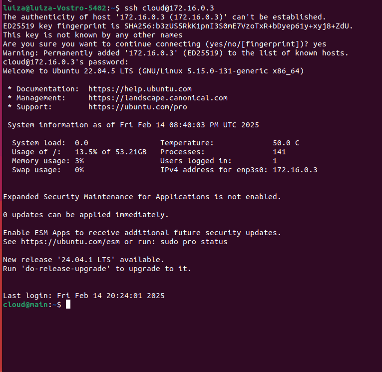
/// caption
Acesso à máquina main
///

### Instalação do MAAS

O MAAS foi instalado para atuar como o gerenciador de hardware do projeto.

Para realizar sua instalação, na versão "stable" 3.5, dentro da máquina main, utilizaram-se os seguintes comandos:

I.
<!-- termynal -->
``` bash
sudo apt update && sudo apt upgrade -y
```
II.
<!-- termynal -->
``` bash
sudo snap install maas --channel=3.5/stable
```
III.
<!-- termynal -->
``` bash
sudo snap install maas-test-db
```

### Configuração do MAAS

Primeiramente, foi realizada a inicialização do MAAS, da seguinte maneira:

<!-- termynal -->
``` bash
sudo maas init region+rack --maas-url http://172.16.0.3:5240/MAAS --database-uri maas-test-db:///
```
Em seguida, a criação do usuário admin:

<!-- termynal -->
``` bash
sudo maas createadmin
```

Com isso, determinou-se o login e a senha.

Posteriormente, foi necessário gerar um par de chaves para autenticação, utilizando o seguinte comando:

<!-- termynal -->
``` bash
ssh-keygen -t rsa
```

E acessar essa chave para poder copiá-la, dessa maneira:

<!-- termynal -->
``` bash
cat ./.ssh/id_rsa.pub
```

A chave pública obtida foi a da figura a seguir:

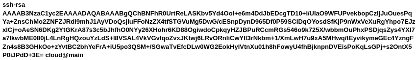
/// caption
Chave pública
///

### Acessando o dashboard do MAAS

O dashboard do MAAS foi acessado através da seguinte URL:

    http://172.16.0.3:5240/MAAS

Porém, antes disso, foi necessário desativar o UFW(firewall), pois ele estava bloqueando todas as portas, menos a 22.

Após realizar o login, configurou-se o DNS Forwader com o DNS do Insper, sendo assim, quando um dispositivo realizar uma consulta DNS, essa solicitação será encaminhada para o DNS do Insper.

Em seguida, as imagens do Ubuntu 22.04LTS e Ubuntu 20.04LTS foram importadas.


/// caption
Imagens Ubuntu
///

**Observação: em momento posterior, essas imagens foram corrompidas por uma atualização da própria Cannonical, sendo assim, foi utilizada a imagem do Ubuntu 24.04 LTS para a realização de tarefas que estão mais à frente**

Por fim, foi realizado o upload da chave SSH gerada, permitindo acesso ao servidor sem pecisar de senha.

#### Chaveando o DHCP

O passo seguinte foi habilitar o DHCP no MAAS, permitindo o gerenciamento dos IPs das outras máquinas.

Para isso, acessou-se o MAAS Controller e definiu-se o reserved range para iniciar em 172.16.11.1 e acabar em 172.16.14.255. Além disso, o DNS da subnet passou a apontar para o DNS do Insper e, por fim, desabilitou-se o DHCP no roteador.

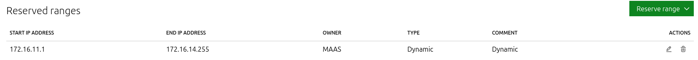
/// caption
DHCP habilitado no MAAS
///

#### Checando a saúde do MAAS

Com o intuito de garantir que estava tudo correto com o MAAS, verificou-se o estado dos serviços do sistema na aba de controladores. A figura abaixo demonstra que tudo ocorreu com êxito.

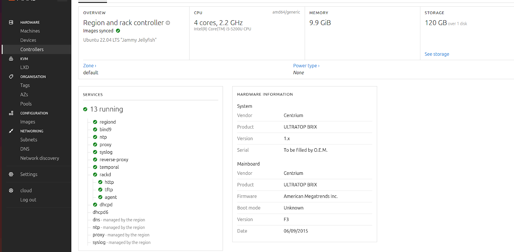
/// caption
Saúde do MAAS
///

#### Comissionando servidores

Após verificar o funcionamento do MAAS, os servidores foram comissionados, ou seja, as máquinas, do server1 ao server5, foram cadastradas no MAAS.

Primeiramente, alterou-se a opção "power type" para INtel AMT, pois essa é a tecnologia de gerenciamento remoto que está presente nas máquinas. Após isso, foram preenchidas as informações sobre o MacAdress das máquinas, presente na parte inferior das mesmas, a senha e o IP do AMT e, como pode-se observar na figura abaixo, o processo ocorreu da maneira desejada.

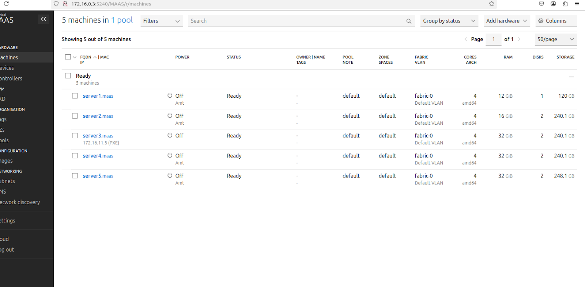
/// caption
Máquinas comissionadas
///

O roteador também foi adicionado como device no dashboard do MAAS.

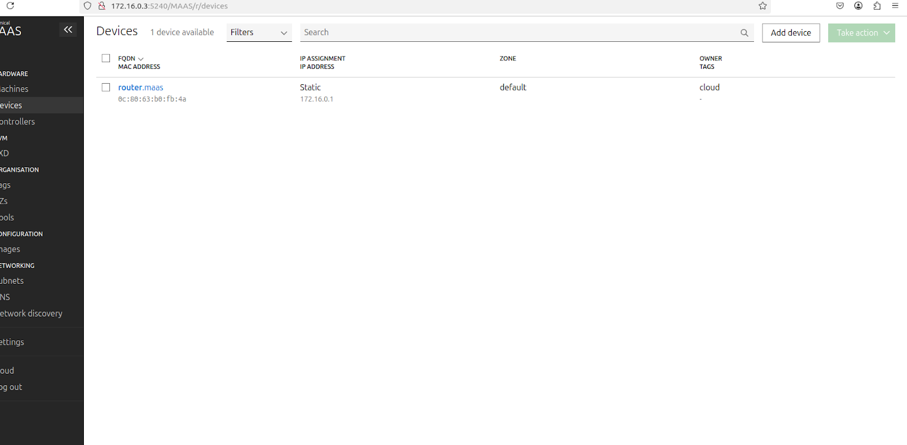
/// caption
Router adicionado
///


#### Criando OVS bridge

A OVS tem o objetivo de permitir conectar mais de uma interface de rede dentro de um servidor físico. Para criá-las, acessou-se a aba rede no MAAS e criou-se uma ponte baseada na interface regular "enp1s0".


### Fazendo acesso remoto ao Kit

O objetivo dessa parte do roteiro é conseguir conectar o server main utilizando a porta 22, via SSH. Para isso, realizou-se um NAT para garantir o acesso externo "Rede Wi-fi Insper" ao main.

Primeiramente, foi necessário abrir a porta 22. Para tal, acessou-se a página do roteador, na aba transmition e depois na aba NAT. Com isso, definiu-se a rede wan1, colocando o ip do roteador (10.103.1.18), a porta externa e interna como 22, o ip interno (172.16.0.3) e o nome como ssh.

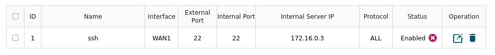
/// caption
Configurando NAT
///

Feito isso, para acessar a main bastou utilizar o seguinte comando:

<!-- termynal -->
``` bash
ssh cloud@10.103.1.18
```

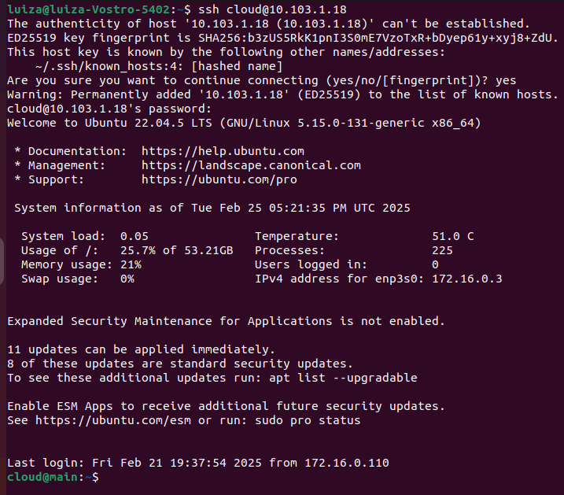
/// caption
Acessando a main
///

Ademais, realizou-se a liberação do acesso ao gerenciamento remoto do roteador, criando uma regra de gestão para a rede 0.0.0.0/0, liberando acesso para todas as máquinas que estão no WI-fi Insper.

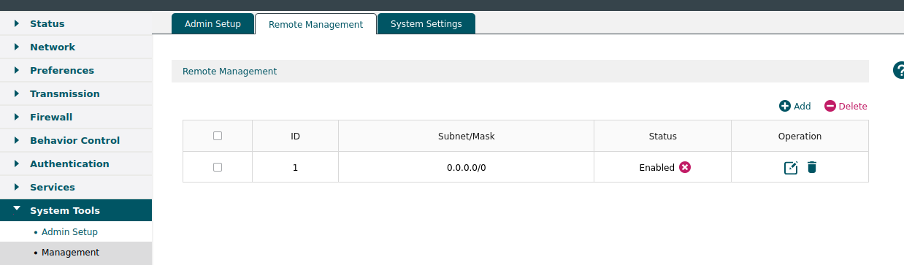
/// caption
Criação da regra de gestão
///


## APP

### Instalando MAAS

<!-- termynal -->

``` bash
sudo snap install maas --channel=3.5/Stable
```


/// caption
Dashboard do MAAS
///

Conforme ilustrado acima, a tela inicial do MAAS apresenta um dashboard com informações sobre o estado atual dos servidores gerenciados. O dashboard é composto por diversos painéis, cada um exibindo informações sobre um aspecto específico do ambiente gerenciado. Os painéis podem ser configurados e personalizados de acordo com as necessidades do usuário.

---

Para iniciar nossa aplicação iniciamos adicionando o DNS do Insper (172.20.129.131) seguindo o padrão. Com isso conseguimos acessar nossa máquina facilmente dentro da rede do Insper.

### Primeira Parte - Banco de Dados

A primeira etapa da Tarefa 1 consistiu na criação de um banco de dados PostgreSQL no server 1. Para isso, foi necessário implantar o Ubuntu 22.04 para Linux no servidor por meio do dashboard do MAAS, uma vez que ele ainda não possuía um sistema operacional.

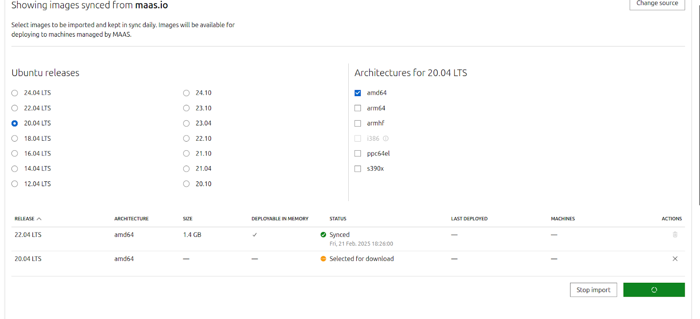
///caption
Tela do MAAS exemplificando processo de dar deploy do Ubuntu 22.04 no Server 1
///

Finalizado o Deploy, acessamos o server 1 pelo terminal e criamos o banco manualmente utilizando os comandos abaixo:

<!-- termynal -->

``` bash
sudo apt update
sudo apt install postgresql postgresql-contrib -y
```

Com o PostgreSQL instalado, criamos um usuário e um database para a aplicação. Porém, para liberar o acesso remoto, tivemos que configurar o arquivo de configuração:

```
  nano /etc/postgresql/14/main/postgresql.conf

```
Adicionando a seguinte linha:

```
  listen_addresses = '*'
```

O último passo foi liberar o acesso para qualquer máquina dentro da subnet do kit com o seguinte comando:

 ```
    host    all             all             172.16.0.0/20          trust
```

E, por fim, liberamos o firewall:

```bash
  sudo ufw allow 5432/tcp
``` 

---

### Tarefa 1

Nossa primeira atividade foi verificar se o **banco de dados PostgreSQL** estava corretamente implantado e funcionando. Para isso, precisamos confirmar que o serviço estava ativo no sistema operacional, acessível localmente na máquina onde foi instalado e que também podia ser alcançado a partir da máquina MAIN, além de identificar em qual porta o serviço estava operando.

Para nos ajudar, utilizamos alguns comandos como: {==ping, ifconfig, systemctl, telnet, ufw, curl, wget e journalctl==}

I.

<!-- termynal -->

``` bash
systemctl status postgresql
```


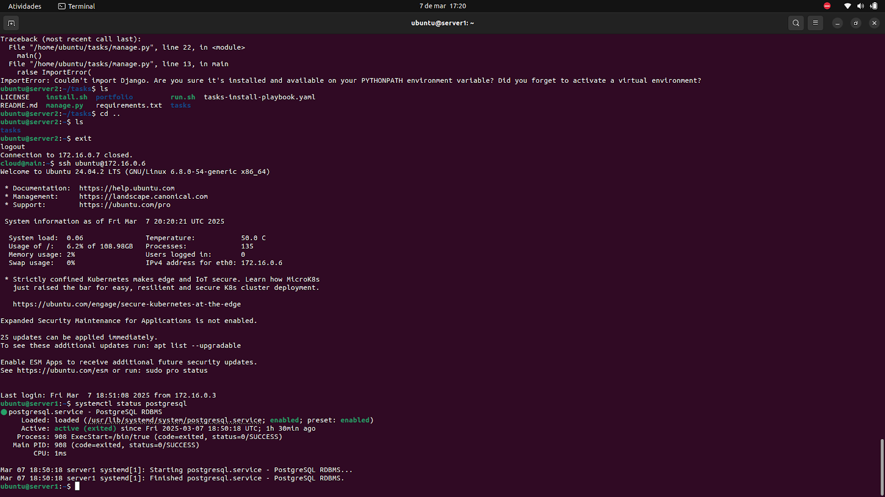
///caption
Banco funcionando e seu Status está como "Ativo" para o Sistema Operacional
///


II.

<!-- termynal -->

``` bash
psql -U cloud -h 172.16.15.0 tasks
```


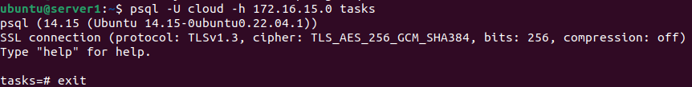
///caption
Banco acessível na própria maquina na qual ele foi implantado.

///

III.

<!-- termynal -->

``` bash
psql -U cloud -h 172.16.15.0 tasks
```


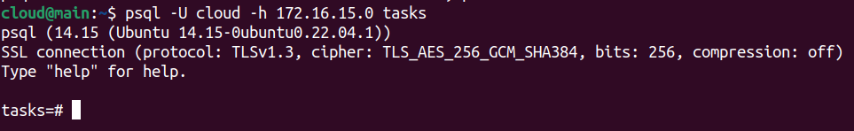
///caption
Banco acessível a partir de uma conexão vinda da máquina MAIN
///

IV.

<!-- termynal -->

``` bash
nmap localhost
```


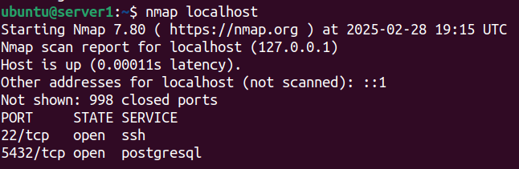
///caption
Porta este serviço está funcionando
///

---
### Segunda Parte - Aplicação Django

A segunda parte do roteiro foi adicionar uma **Aplicação Django** na nossa máquina, mais especificamente no server 2.

Porém, até então só temos o server 2 fisicamente, precisamos criar ele e adicionar o sistema operacional. Para esse processo decidimos adicionar o server 2 usando o terminal, mas esse processo também pode ser feito no Dashboard do MAAS.

- Primeiro pedimos uma máquina


<!-- termynal -->
```bash
  maas login cloud http://172.16.0.3:5240/MAAS/
``` 

- Para evitar ter que sempre autenticar e dar a senha em todos os passos, procuramos a nossa API-KEYS na aba API-KEYS do MAAS.

- Seguimos solicitando a reserva do server 2:

<!-- termynal -->
```bash
  maas cloud machines allocate name=server2
``` 

- Como fizemos pelo Dashboard o deploy do Ubuntu 22.04 no server1, conseguimos fazer por linha de código para o server 2:

<!-- termynal -->
```bash
maas cloud machine deploy [system_id]
``` 
* Esse system_id vem do comando de reserva de máquina!!

- Agora entramos no server 2 utilizando:   ``` ssh ubuntu@172.16.0.7 ``` , que conseguimos ver diretamente da página machines no MAAS.

  * No ssh do server 2 vamos realizar a instalação do arquivo tasks.

<!-- termynal -->
```bash
git clone https://github.com/raulikeda/tasks.git
``` 


<!-- termynal -->
```bash
./install.sh
``` 

 * O próximo passo foi fazer um GET para acessar a URL e abrir visualizar a interface do Django.


<!-- termynal -->
```bash
wget http://[IP server2]:8080/admin/
``` 

 * Mesmo conseguindo acessar o server 2 de dentro, podemos facilitar a entrada no server 2, ou seja, a entrada na interface do Django. Para acessar isso no browser seria necessário fazer um NAT no roteador. Porém vamos criar  um TUNEL SSH, e com esse serviço temporário podemos expor o serviço para fora do kit enquanto o terminal que o tunnel estiver utilizando esteja ativo.

 A ideia principal vai fazer com que após acessar o main pela porta 22, se eu digitasse localhost[alguma porta] , eu iria parar direto no server 2.

 Primeiro saímos da nossa máquina e no terminal da nossa máquina física digitamos o seguinte comando:


```bash
ssh cloud@10.103.0.X -L 8001:[IP server2]:8080
``` 

  * Mudamos a linha de código acima para se adequar a nossa máquina, mudando o IP do roteador e o IP do server 2.


<!-- termynal -->
```bash
ssh cloud@10.103.1.18 -L 8001:172.16.0.7:8080
``` 


### Tarefa 2

Tínhamos as seguintes perguntas para a tarefa 2:

  1. Do Dashboard do **MAAS** com as máquinas.
  2. Da aba images, com as imagens sincronizadas.
  3. Da Aba de cada maquina(5x) mostrando os testes de hardware e commissioning com Status "OK"


I.


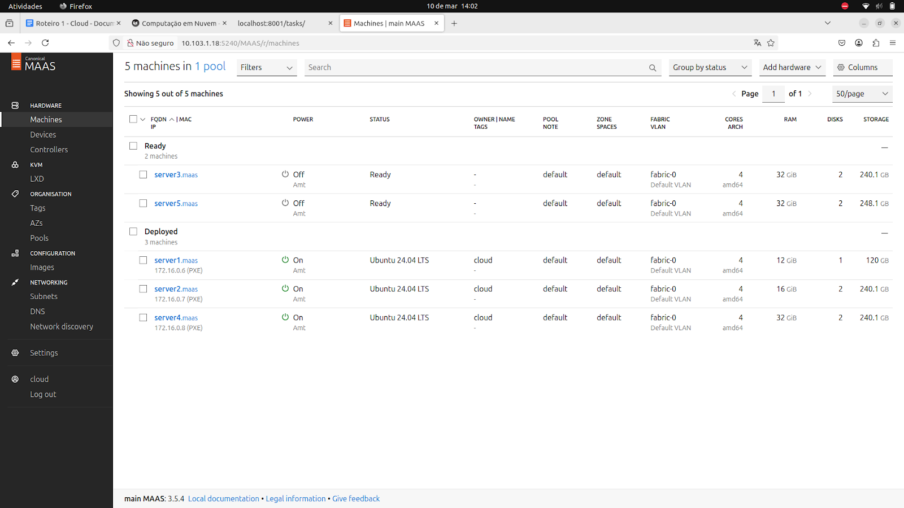
///caption
Machines no MAAS
///


II.

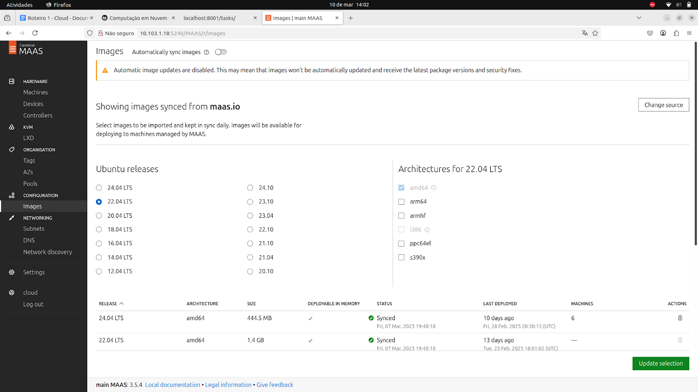
///caption
Imagens sincronizadas
///

III.


///caption
Server 1
///


///caption
Server 2
///


///caption
Server 3
///


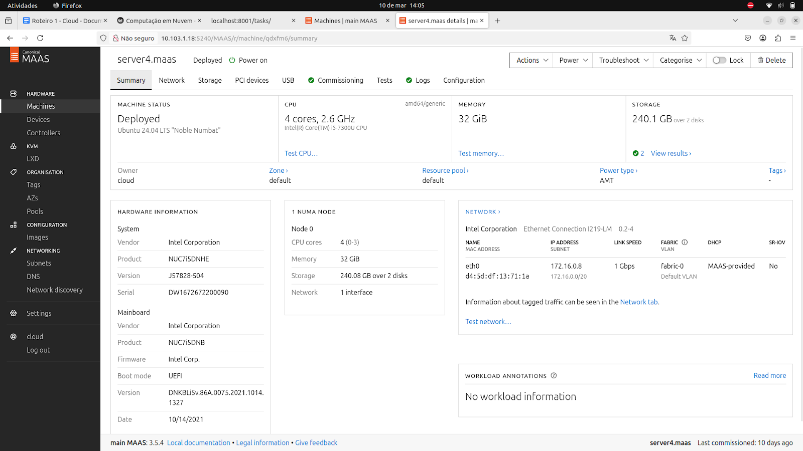
///caption
Server 4
///


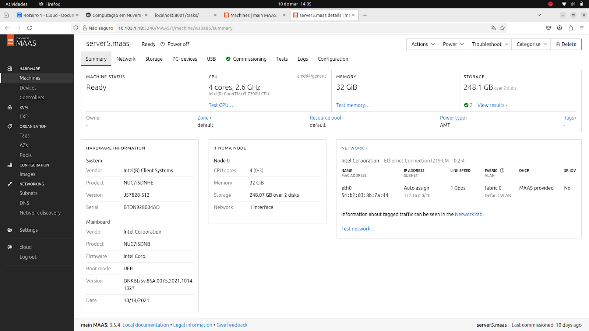
///caption
Server 5
///

---

### Utilizando o Ansible - deploy automatizado de aplicação


### Tarefa 3

  1. De um print da tela do Dashboard do MAAS com as 2 Maquinas e seus respectivos IPs.
  2. De um print da aplicacao Django, provando que voce está conectado ao server
  3. Explique como foi feita a implementacao manual da aplicacao Django e banco de dados.


I.


///caption
Imagens sincronizadas
///

II.

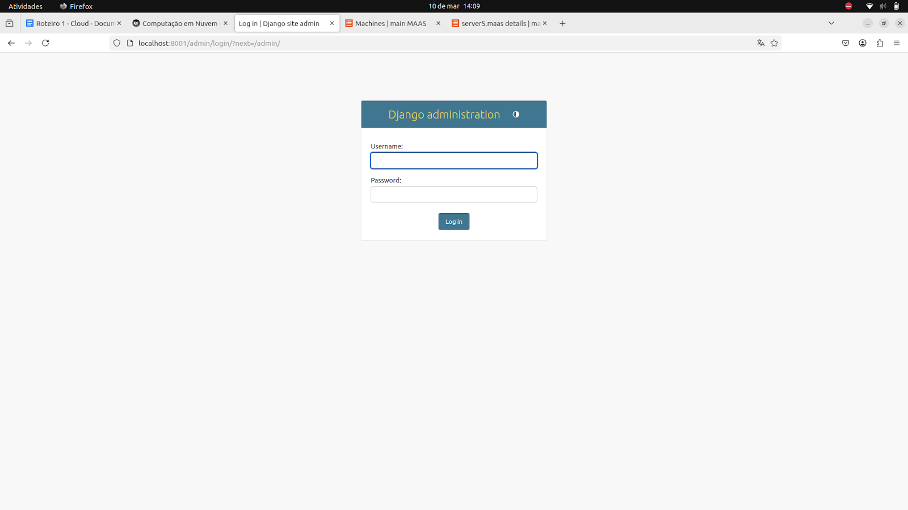
///caption
Server 1
///

III. Para realizar essas ações manualmente, seguimos o roteiro do professor. Revisitar:

 * Primeira parte - Banco de Dados 

 * Segunda parte - Aplicação Django


Até agora tinhamos uma Aplicação Django, mas agora teremos 2 aplicações django (server2 e server3) compartilhando o mesmo banco de dados (server1). Os motivos para fazermos isso são dois:

* Alta disponibilidade: se um node cair o outro está no ar, para que nosso cliente acesse.

* Load Balancing: podemos dividir a carga de acesso entre os nós.

Para fazer essa aplicação fizemos tudo **manualmente** a partir do terminal, mas existem aplicações que realizam esse trabalho **automáticamente** para nós. Nesse roteiro vamos usar o gerenciador de deploy {==**Ansible**==}

- Para começar pedimos  o deploy no server 3 para o MAAS via cli

- Depois dentro do MAIN fizemos a instalação do Ansible, usando o seguinte comando:


<!-- termynal -->
```bash
 sudo apt install ansible
``` 

- 

<!-- termynal -->
```bash
wget https://raw.githubusercontent.com/raulikeda/tasks/master/tasks-install-playbook.yaml
``` 

- 

<!-- termynal -->
```bash
ansible-playbook tasks-install-playbook.yaml --extra-vars server=172.16.0.10
``` 


### Tarefa 4 

1. De um print da tela do Dashboard do MAAS com as 3 Maquinas e seus respectivos IPs.
2. De um print da aplicacao Django, provando que voce está conectado ao server2 
3. De um print da aplicacao Django, provando que voce está conectado ao server3 
4. Explique qual diferenca entre instalar manualmente a aplicacao Django e utilizando o Ansible.

I.

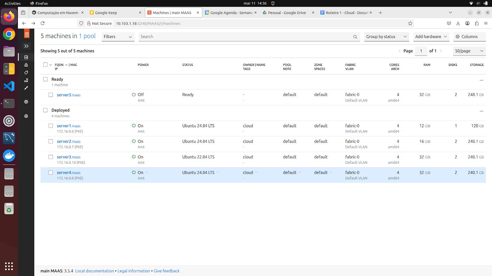
///caption
Machines no MAAS
///

II.

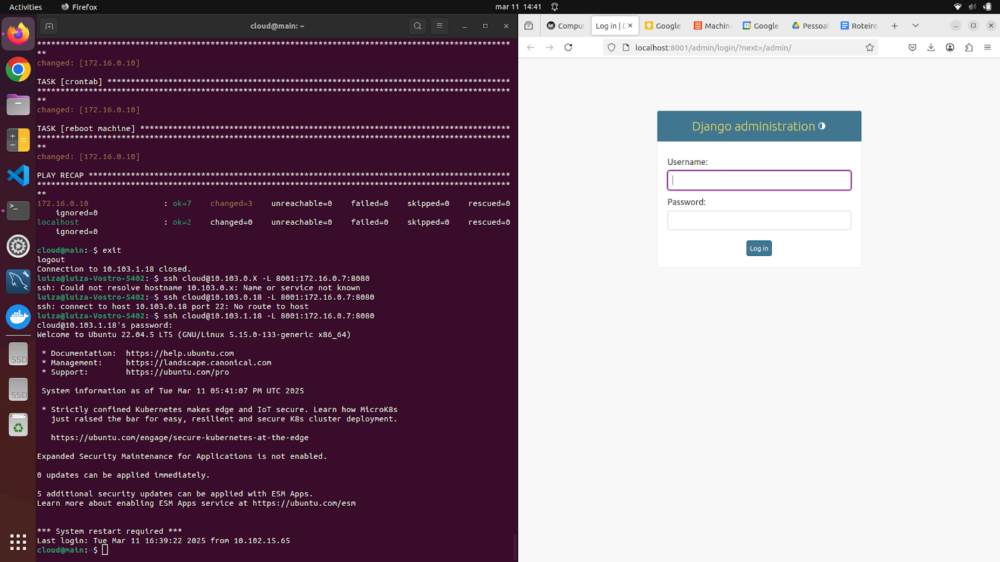
///caption
Server 2
///

III.

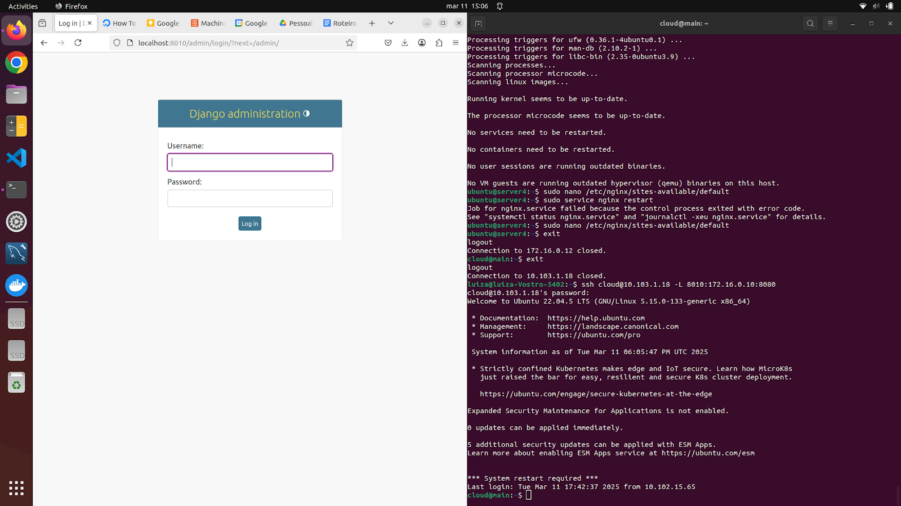
///caption
Server 3
///

IV.
Primeiro, fizemos manualmente o deploy do server 2 via MAAS e instalamos o Django pelo terminal. Para acessá-lo, entramos na main via SSH (porta 22) e depois no server 2 pela porta 8080.

Para automatizar a instalação, usamos o Ansible, que executa tudo de uma vez com um playbook (script com todos os comando compactados). Além disso, vamos criar um túnel SSH para acessar o server 2 diretamente pela porta 8001, sem precisar passar pela main manualmente.

---
### Balancamento de carga usando Proxy Reverso

Para montar o ponto único de entrada, utilizaremos uma aplicação de proxy reverso como load balancer. Vamos usar o server 4 e usar o **NGINX** nele.

!!! note "NGINX"

    Loadbalancing é um mecanismo útil para distribuir o tráfego de entrada por vários servidores privados virtuais capazes

    * Em resumo, ele vai fazer o balanceamento das máquinas (server 2 ou 3).

    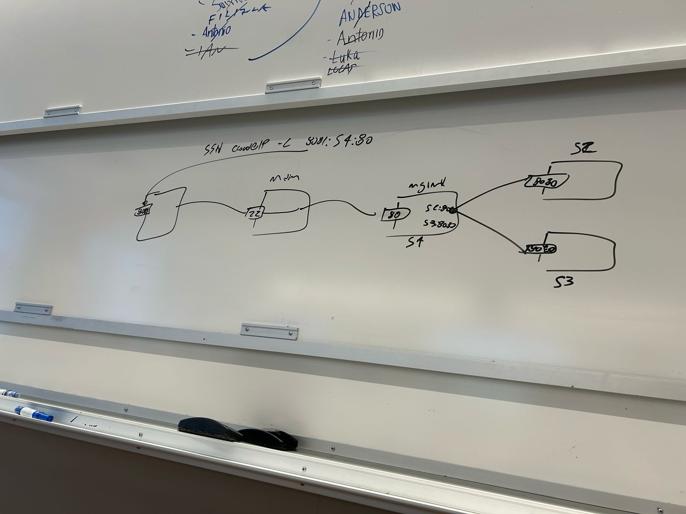
    ///caption
    Resultado final que queremos
    ///


- Primeiro instalamos o NGINX no server 4

```bash
sudo apt-get install nginx
``` 

- Para configurar um loadbalancer round robin, precisamos usar o módulo upstream do nginx. Incorporamos a configuração nas definições do nginx.

```bash
sudo nano /etc/nginx/sites-available/default
``` 

-  Precisamos incluir o módulo upstream, que se parece com isto:

```
upstream backend {server 172.16.0.7; server 172.16.0.10; }
server { location / { proxy_pass http://backend; } }
``` 

- Depois reiniciamos o NGINX

```bash
sudo service nginx restart
``` 

- Agora para identificar cada server, precisamos alterar no arquivo de tasks/views.py de cada Django a mensagem "Hello World ...".

- Entrando no server 2 e 3 de cada vez digitamos em cada:

```bash
cd tasks/tasks/views.py
``` 

```
from django.shortcuts import render

from django.http import HttpResponse

def index(request):

  return HttpResponse("Server X")
``` 

  * Mudamos o "X" para o número do Server que estávamos !!


- No arquivo de urls.py de cada Server customizamos o path no urlpatterns:

```bash
cd tasks/tasks/urls.py
```

```
urlpatterns = [path( ' ', views.index, name='index'),]
``` 

### Tarefa 5 

1. De um print da tela do Dashboard do MAAS com as 4 Maquinas e seus respectivos IPs.
2. Altere o conteúdo da mensagem contida na função `index` do arquivo `tasks/views.py` de cada server para distinguir ambos os servers. 
3. Faça um `GET request` para o path que voce criou em urls.py para o Nginx e tire 2 prints das respostas de cada request, provando que voce está conectado ao server 4, que é o Proxy Reverso e que ele bate cada vez em um server diferente server2 e server3.

I.

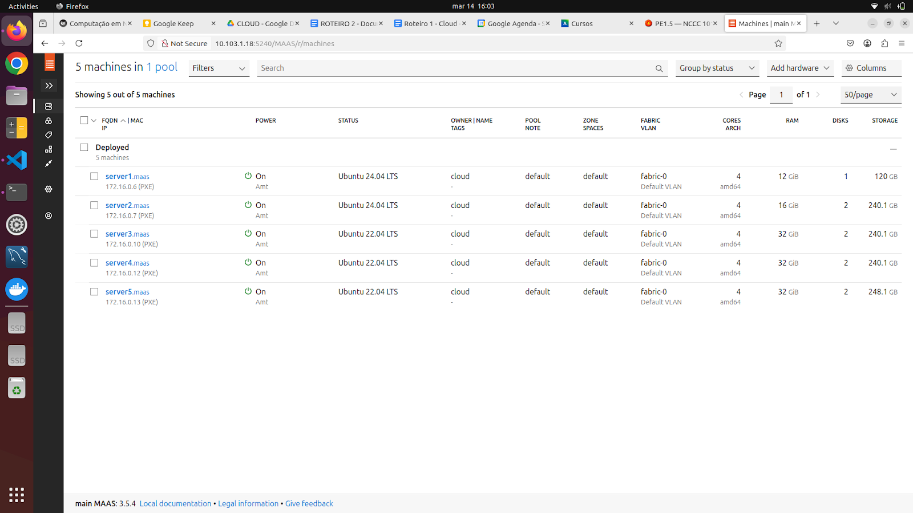
///caption
Machines no MAAS
///


II.


///caption
Alteração URL do Server 2
///

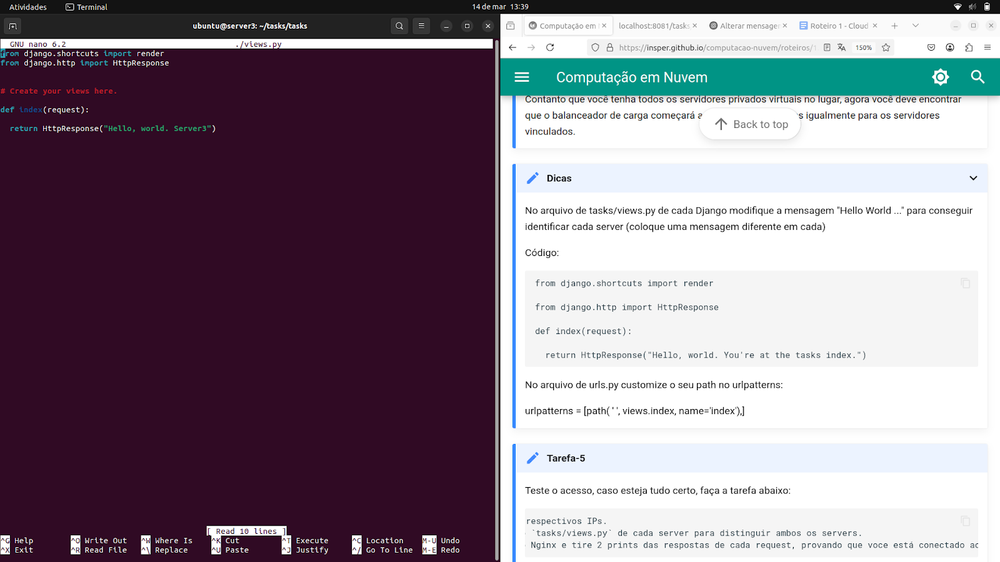
///caption
Alteração URL do Server 3
///

III.

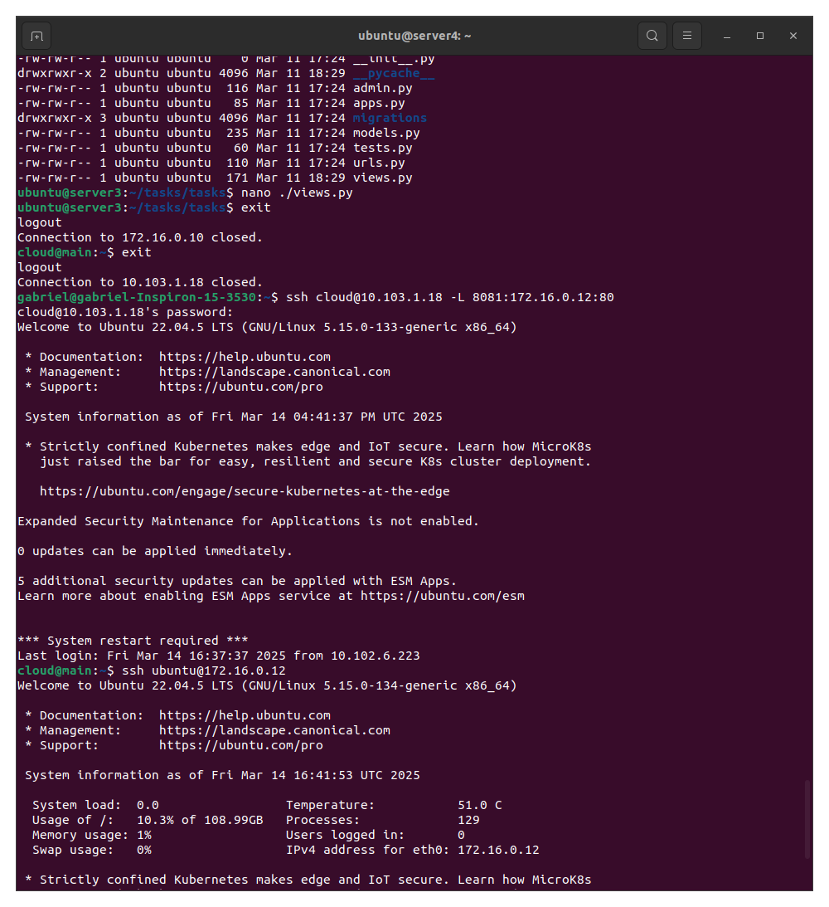
///caption
Código para GET Request
///

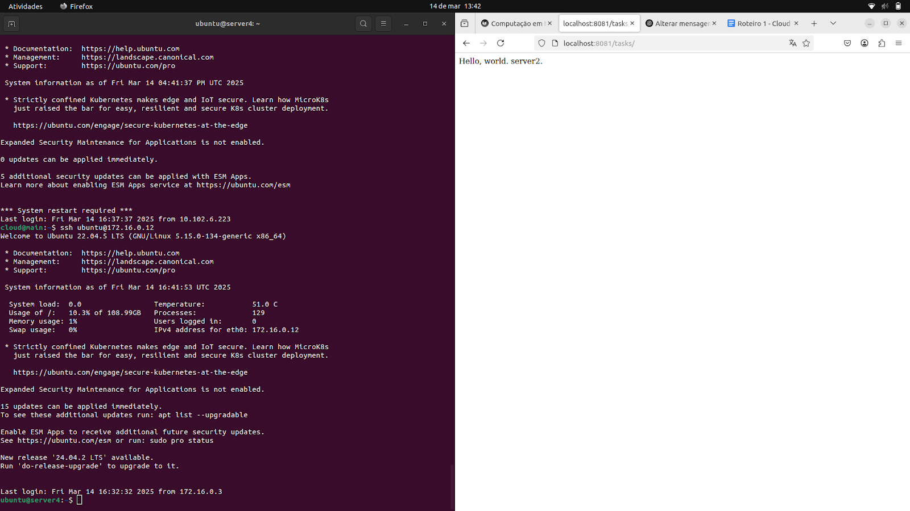
///caption
GET Request Server 2
///


///caption
GET Request Server 3
///

## Discussões

Acreditamos que as maiores dificuldades foram problemas relacionados a versões de aplicações de terceiros que, em alguns casos, haviam sido atualizadas, exigindo que buscássemos novas documentações para entender a maneira correta de utilizá-las para o que precisávamos. Além disso, o entendimento da teoria de computação em nuvem foi desafiador, pois, muitas vezes, são tópicos complexos e que, sem dominá-los, não poderíamos prosseguir para as próximas etapas. Por outro lado, quando compreendidos, as coisas passavam a fazer mais sentido, tornando o processo mais natural.

Depois de fazermos algumas ações manualmente e fixarmos bem os conceitos, quando avançamos nos roteiros e vimos aplicações que automatizavam essas ações, como o MAAS, Ansible e Nginx, nosso entendimento e aplicação dos processos tornou-se mais claro e produtivo.

## Conclusão

Por meio deste roteiro, pudemos compreender a complexidade das redes de computadores, bem como sua importância para projetos que demandam escalabilidade e eficiência. A exploração de ferramentas como o MAAS (Metal as a Service), o Ansible e o Nginx nos permitiu compreender conceitos sobre gerenciamento de hardware, automação de tarefas e redes, destacando a relevância de aplicações robustas nesse contexto. Essa base teórica e prática esclareceu aspectos essenciais da computação em nuvem e abre caminho para futuros aprofundamentos e aplicações em projetos mais complexos. 


